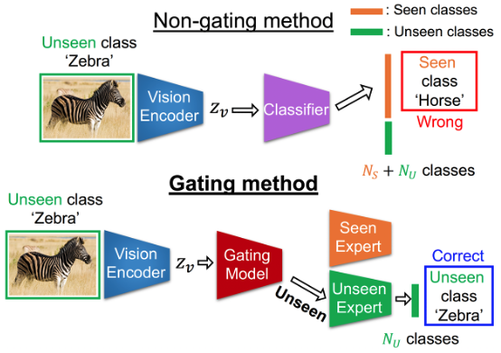

# A Gating Model for Bias Calibration in Generalized Zero-shot Learning

This work was conducted in the [OLIVES @ Georgia Institute of Technology](http://www.ghassanalregib.info)

This is an official code repository for the paper:

[Gukyeong Kwon](https://https://gukyeongkwon.github.io/) and [Ghassan AlRegib](http://www.ghassanalregib.info), "A Gating Model for Bias Calibration in Generalized Zero-shot Learning," *IEEE Transactions on Image Processing*, 2022.

If you find our codes useful, we kindly ask you to cite our work. 
```tex
@article{kwon2022gating,
  title={A Gating Model for Bias Calibration in Generalized Zero-shot Learning},
  author={Kwon, Gukyeong and Al Regib, Ghassan},
  journal={IEEE Transactions on Image Processing},
  year={2022},
  publisher={IEEE}
}
```
--------

<p align="center">

</p>

## Getting Started

### Set up the environment
Clone this repository and run following commands to create a conda environment and install all dependencies.
```
conda create -n gating-ae python=3.8
conda activate gating-ae
cd gating-ae
conda install pytorch torchvision -c pytorch
pip install -r requirments.txt
```

### Prepare datasets
GatingAE is evaluated on four datasets which are CUB, SUN, AWA2, and AWA1. The dataset can be downloaded from [here](https://www.dropbox.com/sh/btoc495ytfbnbat/AAAaurkoKnnk0uV-swgF-gdSa?dl=0), which is prepared by the authors of the [CADA-VAE](https://github.com/edgarschnfld/CADA-VAE-PyTorch) project.


## Training and Evaluation of GatingAE
Run following commands:
### Use the training split for training
```bash
# Train an autoencoder
python train_ae.py --data_path './data' --dataset 'CUB' --save_name 'gating-ae_train'

# Train a seen expert
python train_seen_expert.py --data_path './data' --dataset 'CUB' --save_name 'seen_expert_train'
```

### Use the train + val split for training
```bash
# Train an autoencoder
python train_ae.py --data_path './data' --dataset 'CUB' --save_name 'gating-ae_trainval' --use_trainval

# Train a seen expert
python train_seen_expert.py --data_path './data' --dataset 'CUB' --save_name 'seen_expert_trainval' --use_trainval
```

### Trained Weights for CUB
We share the weights of GatingAE trained on CUB for reproducibility. The model weights can be downloaded [here](https://drive.google.com/uc?export=download&id=1t6foVAcHustBTt-h_gVuwQHej_otvHCM). There exist four models: autoencoders and seen experts trained on the train split and the trainval split. There name convention is as follows:    

Splits   | Autoencoder | Seen expert | 
:-------:|:-----------:|:-----------:|
train    |  CUB_gating-ae_train    | CUB_seen_expert_train    |
trainval |CUB_gating-ae_trainval   | CUB_seen_expert_trainval |

The downloaded models can be unzipped and placed under the `save` folder for evaluation.  


### Evaluation
```bash
python eval.py \
  --dataset 'CUB' \
  --data_path './data' \
  --val_ae_resume './save/CUB_gating-ae_train/checkpoint.pth' \ 
  --val_clf_resume './save/CUB_seen_expert_train/checkpoint.pth' \
  --trainval_ae_resume './save/CUB_gating-ae_trainval/checkpoint.pth' \ 
  --trainval_clf_resume './save/CUB_seen_expert_trainval/checkpoint.pth'
```
